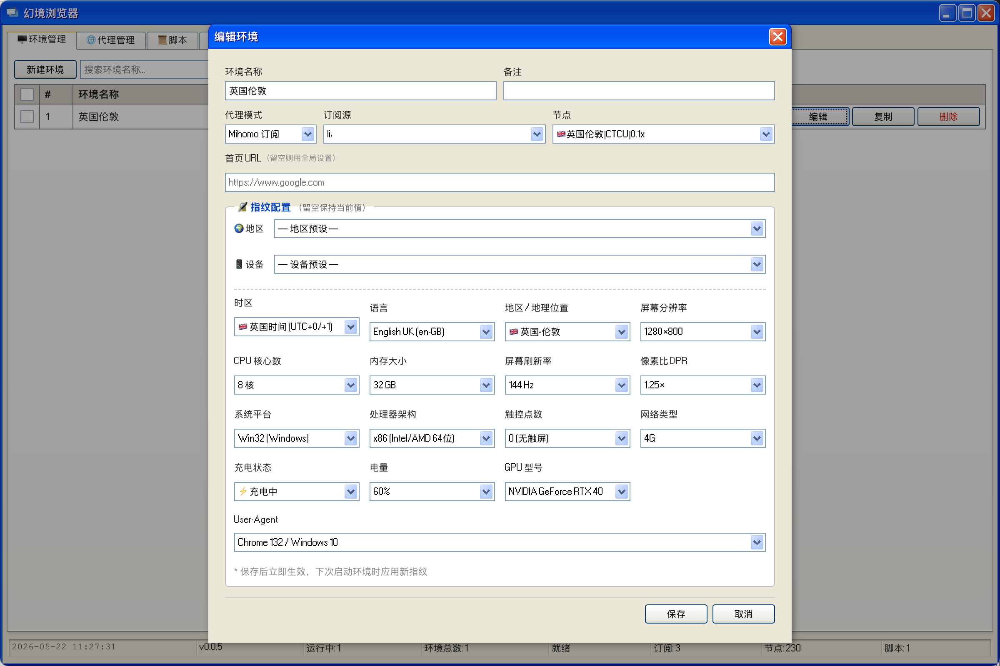
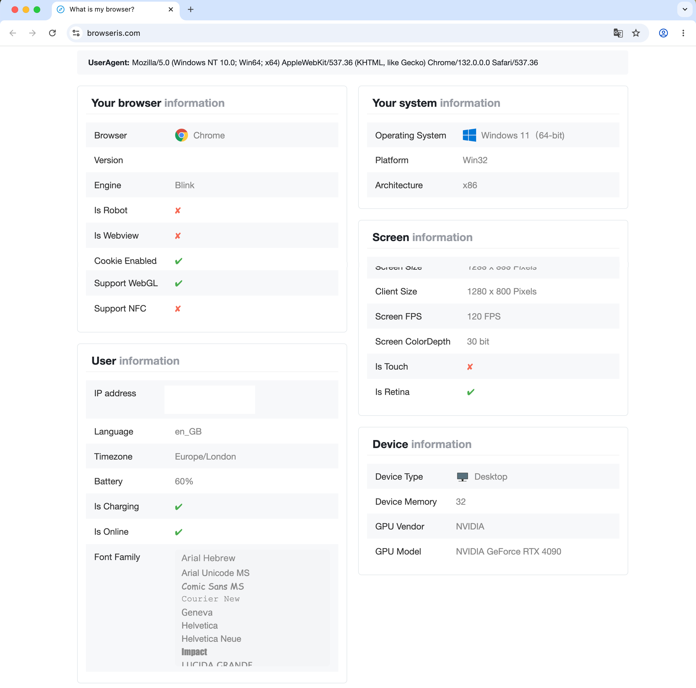

<div align="center">

# 幻境浏览器 · Mirage Browser

**多环境隔离 · 指纹伪造 · 代理集成 · 脚本注入**

[](https://github.com/taills/Mirage-Browser/releases)
[](LICENSE)
[](#)
[](https://www.electronjs.org/)

**[简体中文](#简体中文) · [繁體中文](#繁體中文) · [English](#english)**

</div>

---

<a name="简体中文"></a>
# 简体中文

幻境浏览器（Mirage Browser）是一款基于 Electron 的**指纹浏览器管理工具**。  
它能在同一台机器上同时启动多个完全隔离的 Chrome 实例，每个实例拥有独立的用户数据、自定义浏览器指纹和独立的代理出口，专为多账号运营、隐私保护和自动化场景设计。

界面采用经典 Windows XP 复古风格（[XP.css](https://github.com/botoxparty/XP.css)）。

---

### 自定义浏览器指纹信息



### 浏览器指纹检测



---

## ✨ 功能特性

### 🪟 多环境隔离管理
- 一键创建、启动、关闭任意数量的独立 Chrome 环境
- 每个环境拥有完全独立的 Profile 目录，Cookie、缓存、存储互不干扰
- 支持批量创建（最多 100 个），自动生成随机指纹配置
- 可为每个环境单独设置主页、备注

### 🎭 浏览器指纹伪造
通过 Chrome DevTools Protocol (CDP) 在每个环境启动时注入指纹覆盖脚本：

| 指纹维度 | 支持项 |
|---|---|
| 地区 | 时区、语言（`navigator.language`）、地理坐标（Geolocation API） |
| 硬件 | 逻辑处理器数、设备内存、屏幕分辨率、色深、刷新率、像素比 |
| 平台 | `navigator.platform`、`navigator.userAgent`、CPU 架构 |
| 渲染 | Canvas 2D 噪声种子、WebGL 渲染参数噪声、GPU Vendor / Renderer |
| 设备 | 触控点数、电池电量/充电状态、网络连接类型 |

支持**随机生成**或**手动指定**每项参数，内置 16 个城市地理坐标预设。

### 🌐 代理集成
- **直连代理**：为每个环境单独配置 HTTP/SOCKS 代理地址
- **Mihomo 订阅代理**：
  - 内置 Mihomo（原 Clash Meta）内核下载与管理
  - 支持导入订阅链接或本地 YAML 配置文件
  - 节点延迟测试（TCP Ping），按延迟排序筛选
  - 每个环境可绑定不同的订阅源和节点

### 💉 脚本注入
- 编写自定义 JavaScript，通过 CDP 注入到指定运行中的环境
- 支持多个脚本管理，可随时切换并执行

### 🔐 证书管理
- 导入 CA 证书（`.pem` / `.crt` / `.cer`）到操作系统信任存储
- 支持 macOS Keychain、Windows 证书存储、Linux NSS 数据库
- 自动提取证书指纹（SHA-256/SHA-1）用于验证

---

## 📦 安装

### 下载预构建包

前往 [Releases](https://github.com/taills/Mirage-Browser/releases) 页面，下载对应平台的安装包：

| 平台 | 便携包（解压即用） | 安装包 |
|---|---|---|
| macOS | `.zip` | — |
| Windows | `.zip` | `.exe`（Squirrel 安装包） |
| Linux | `.zip` | `.deb` / `.rpm` |

### 前置要求

- **Google Chrome** 或 Chromium 浏览器（需已安装）
- macOS 10.15+ / Windows 10+ / Ubuntu 20.04+

---

## 🚀 快速上手

1. **启动应用**，在「设置」页面确认 Chrome 路径已自动检测
2. 前往「环境」页面，点击「新建环境」创建一个浏览器实例
3. 配置指纹参数（或使用随机生成）、选择代理节点
4. 点击「启动」，即可打开一个带有自定义指纹的 Chrome 实例
5. 如需代理，在「代理」页面添加订阅链接，测试节点延迟后绑定到对应环境

---

## 🛠️ 开发

### 环境准备

```bash
# 需要 Node.js 18+
node -v

# 克隆仓库
git clone https://github.com/taills/Mirage-Browser.git
cd Mirage-Browser

# 安装依赖
npm install
```

### 开发模式（含热更新）

```bash
npm start
```

### 构建 & 打包

```bash
npm run make        # 构建当前平台安装包，输出到 out/make/
npm run package     # 仅打包（不生成安装包）
```

### 发布多平台包

推送 `v*` 格式 tag，GitHub Actions 自动在 macOS / Windows / Linux 三端并行构建并发布到 Releases：

```bash
git tag v1.0.0
git push origin v1.0.0
```

---

## 🏗️ 技术栈

| 层 | 技术 |
|---|---|
| 框架 | [Electron 42](https://www.electronjs.org/) + [Vite 5](https://vitejs.dev/) |
| 语言 | TypeScript |
| UI | [XP.css](https://github.com/botoxparty/XP.css)（Windows XP 复古风格） |
| 浏览器控制 | Chrome DevTools Protocol (CDP) via WebSocket |
| 代理内核 | [Mihomo](https://github.com/MetaCubeX/mihomo)（原 Clash Meta） |
| 构建 & 发布 | [Electron Forge](https://www.electronforge.io/) + GitHub Actions |

---

## 🔗 相关参考

- 指纹检测工具：[browseris.com](https://browseris.com/) · [passer-by.com/browser](https://passer-by.com/browser/) · [github.com/mumuy/browser](https://github.com/mumuy/browser/)
- [Mihomo 文档](https://wiki.metacubex.one/)
- [Chrome DevTools Protocol](https://chromedevtools.github.io/devtools-protocol/)

---

## 📄 授权协议

[MIT](LICENSE) © 2024 taills

---

<a name="繁體中文"></a>
# 繁體中文

幻境瀏覽器（Mirage Browser）是一款基於 Electron 的**指紋瀏覽器管理工具**。  
它能在同一台機器上同時啟動多個完全隔離的 Chrome 實例，每個實例擁有獨立的使用者資料、自訂瀏覽器指紋和獨立的代理出口，專為多帳號運營、隱私保護和自動化場景設計。

介面採用經典 Windows XP 復古風格（[XP.css](https://github.com/botoxparty/XP.css)）。

---

## ✨ 功能特性

### 🪟 多環境隔離管理
- 一鍵建立、啟動、關閉任意數量的獨立 Chrome 環境
- 每個環境擁有完全獨立的 Profile 目錄，Cookie、快取、儲存互不干擾
- 支援批次建立（最多 100 個），自動產生隨機指紋配置
- 可為每個環境單獨設定首頁、備註

### 🎭 瀏覽器指紋偽造
透過 Chrome DevTools Protocol (CDP) 在每個環境啟動時注入指紋覆寫腳本：

| 指紋維度 | 支援項目 |
|---|---|
| 地區 | 時區、語言（`navigator.language`）、地理坐標（Geolocation API） |
| 硬體 | 邏輯處理器數、裝置記憶體、螢幕解析度、色深、更新率、像素比 |
| 平台 | `navigator.platform`、`navigator.userAgent`、CPU 架構 |
| 渲染 | Canvas 2D 雜訊種子、WebGL 渲染參數雜訊、GPU Vendor / Renderer |
| 裝置 | 觸控點數、電池電量/充電狀態、網路連線類型 |

支援**隨機產生**或**手動指定**每項參數，內建 16 個城市地理坐標預設。

### 🌐 代理整合
- **直連代理**：為每個環境單獨配置 HTTP/SOCKS 代理位址
- **Mihomo 訂閱代理**：
  - 內建 Mihomo（原 Clash Meta）核心下載與管理
  - 支援匯入訂閱連結或本地 YAML 設定檔
  - 節點延遲測試（TCP Ping），依延遲排序篩選
  - 每個環境可綁定不同的訂閱來源和節點

### 💉 腳本注入
- 撰寫自訂 JavaScript，透過 CDP 注入至指定執行中的環境
- 支援多個腳本管理，可隨時切換並執行

### 🔐 憑證管理
- 匯入 CA 憑證（`.pem` / `.crt` / `.cer`）至作業系統信任存放區
- 支援 macOS Keychain、Windows 憑證存放區、Linux NSS 資料庫
- 自動提取憑證指紋（SHA-256/SHA-1）用於驗證

---

## 📦 安裝

### 下載預建套件

前往 [Releases](https://github.com/taills/Mirage-Browser/releases) 頁面，下載對應平台的安裝包：

| 平台 | 便攜包（解壓即用） | 安裝包 |
|---|---|---|
| macOS | `.zip` | — |
| Windows | `.zip` | `.exe`（Squirrel 安裝包） |
| Linux | `.zip` | `.deb` / `.rpm` |

### 前置要求

- **Google Chrome** 或 Chromium 瀏覽器（需已安裝）
- macOS 10.15+ / Windows 10+ / Ubuntu 20.04+

---

## 🚀 快速上手

1. **啟動應用程式**，在「設定」頁面確認 Chrome 路徑已自動偵測
2. 前往「環境」頁面，點擊「新建環境」建立一個瀏覽器實例
3. 配置指紋參數（或使用隨機產生）、選擇代理節點
4. 點擊「啟動」，即可開啟一個帶有自訂指紋的 Chrome 實例
5. 如需代理，在「代理」頁面新增訂閱連結，測試節點延遲後綁定至對應環境

---

## 🛠️ 開發

### 環境準備

```bash
# 需要 Node.js 18+
node -v

# 複製倉庫
git clone https://github.com/taills/Mirage-Browser.git
cd Mirage-Browser

# 安裝相依套件
npm install
```

### 開發模式（含熱更新）

```bash
npm start
```

### 建置 & 打包

```bash
npm run make        # 建置當前平台安裝包，輸出至 out/make/
npm run package     # 僅打包（不產生安裝包）
```

### 發布多平台套件

推送 `v*` 格式 tag，GitHub Actions 自動在 macOS / Windows / Linux 三端並行建置並發布至 Releases：

```bash
git tag v1.0.0
git push origin v1.0.0
```

---

## 🏗️ 技術堆疊

| 層次 | 技術 |
|---|---|
| 框架 | [Electron 42](https://www.electronjs.org/) + [Vite 5](https://vitejs.dev/) |
| 語言 | TypeScript |
| UI | [XP.css](https://github.com/botoxparty/XP.css)（Windows XP 復古風格） |
| 瀏覽器控制 | Chrome DevTools Protocol (CDP) via WebSocket |
| 代理核心 | [Mihomo](https://github.com/MetaCubeX/mihomo)（原 Clash Meta） |
| 建置 & 發布 | [Electron Forge](https://www.electronforge.io/) + GitHub Actions |

---

## 🔗 相關參考

- 指紋檢測工具：[browseris.com](https://browseris.com/) · [passer-by.com/browser](https://passer-by.com/browser/) · [github.com/mumuy/browser](https://github.com/mumuy/browser/)
- [Mihomo 文件](https://wiki.metacubex.one/)
- [Chrome DevTools Protocol](https://chromedevtools.github.io/devtools-protocol/)

---

## 📄 授權協議

[MIT](LICENSE) © 2024 taills

---

<a name="english"></a>
# English

**Mirage Browser** is an Electron-based **fingerprint browser manager**.  
It launches multiple fully isolated Chrome instances on a single machine — each with its own user data directory, spoofed browser fingerprint, and dedicated proxy — designed for multi-account management, privacy protection, and browser automation.

The UI uses the classic Windows XP retro style via [XP.css](https://github.com/botoxparty/XP.css).

---

## ✨ Features

### 🪟 Multi-Environment Isolation
- Create, launch, and close any number of independent Chrome environments with a single click
- Each environment has a completely isolated Profile directory — cookies, cache, and storage never cross-contaminate
- Batch creation (up to 100 at once) with auto-generated random fingerprint configs
- Per-environment custom homepage and notes

### 🎭 Browser Fingerprint Spoofing
Fingerprint override scripts are injected via Chrome DevTools Protocol (CDP) at environment startup:

| Dimension | Spoofed Properties |
|---|---|
| Region | Timezone, language (`navigator.language`), geolocation coordinates |
| Hardware | CPU logical cores, device memory, screen resolution, color depth, refresh rate, device pixel ratio |
| Platform | `navigator.platform`, `navigator.userAgent`, CPU architecture |
| Rendering | Canvas 2D noise seed, WebGL rendering noise, GPU Vendor / Renderer |
| Device | Max touch points, battery level / charging status, network effective type |

Every parameter supports **random generation** or **manual override**, with 16 built-in city geolocation presets.

### 🌐 Proxy Integration
- **Direct proxy**: Configure a per-environment HTTP/SOCKS proxy address
- **Mihomo subscription proxy**:
  - Built-in Mihomo (formerly Clash Meta) core download and lifecycle management
  - Import subscription URLs or local YAML config files
  - TCP Ping latency test with latency-sorted node filtering
  - Each environment can be bound to a different subscription source and node

### 💉 Script Injection
- Write custom JavaScript and inject it into any running environment via CDP
- Manage multiple scripts and switch between them at any time

### 🔐 Certificate Management
- Import CA certificates (`.pem` / `.crt` / `.cer`) into the OS trust store
- Supports macOS Keychain, Windows Certificate Store, and Linux NSS database
- Automatically extracts SHA-256 / SHA-1 fingerprints for verification

---

## 📦 Installation

### Download Pre-built Packages

Visit the [Releases](https://github.com/taills/Mirage-Browser/releases) page and download the package for your platform:

| Platform | Portable (no install needed) | Installer |
|---|---|---|
| macOS | `.zip` | — |
| Windows | `.zip` | `.exe` (Squirrel installer) |
| Linux | `.zip` | `.deb` / `.rpm` |

### Prerequisites

- **Google Chrome** or Chromium browser (must be installed separately)
- macOS 10.15+ / Windows 10+ / Ubuntu 20.04+

---

## 🚀 Quick Start

1. **Launch the app** — confirm Chrome path is auto-detected on the Settings page
2. Go to the **Environments** page and click **New Environment**
3. Configure fingerprint parameters (or use random generation) and select a proxy node
4. Click **Launch** — a Chrome instance with your custom fingerprint opens
5. For proxy support, add a subscription URL on the **Proxy** page, test node latency, then bind it to the environment

---

## 🛠️ Development

### Prerequisites

```bash
# Requires Node.js 18+
node -v

# Clone the repository
git clone https://github.com/taills/Mirage-Browser.git
cd Mirage-Browser

# Install dependencies
npm install
```

### Dev Mode (with hot reload)

```bash
npm start
```

### Build & Package

```bash
npm run make        # Build installer for current platform → out/make/
npm run package     # Package only (no installer)
```

### Release Multi-Platform Builds

Push a `v*` tag — GitHub Actions automatically builds and publishes for macOS / Windows / Linux in parallel:

```bash
git tag v1.0.0
git push origin v1.0.0
```

---

## 🏗️ Tech Stack

| Layer | Technology |
|---|---|
| Framework | [Electron 42](https://www.electronjs.org/) + [Vite 5](https://vitejs.dev/) |
| Language | TypeScript |
| UI | [XP.css](https://github.com/botoxparty/XP.css) (Windows XP retro style) |
| Browser Control | Chrome DevTools Protocol (CDP) over WebSocket |
| Proxy Core | [Mihomo](https://github.com/MetaCubeX/mihomo) (formerly Clash Meta) |
| Build & Release | [Electron Forge](https://www.electronforge.io/) + GitHub Actions |

---

## 🔗 References

- Fingerprint detection tools: [browseris.com](https://browseris.com/) · [passer-by.com/browser](https://passer-by.com/browser/) · [github.com/mumuy/browser](https://github.com/mumuy/browser/)
- [Mihomo Documentation](https://wiki.metacubex.one/)
- [Chrome DevTools Protocol](https://chromedevtools.github.io/devtools-protocol/)

---

## 📄 License

[MIT](LICENSE) © 2024 taills